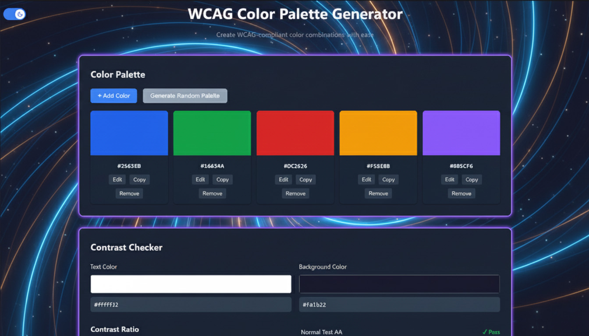

# 🎨 WCAG Color Palette Generator
<div align="center">
  <p>
    <strong>Create beautiful, accessible color palettes with WCAG compliance in mind</strong>
  </p>
</div>

## 📸 Preview




  

## ✨ Features
<details>
  <summary><strong>🎨 Color Palette Management</strong></summary>

- Create and customize color palettes with ease
- Add/remove colors with a single click
- Generate random WCAG-compliant color palettes
- Visual representation of color combinations
</details>

<details>
  <summary><strong>🔍 Contrast Checker</strong></summary>

- Real-time WCAG contrast ratio calculation
- Compliance indicators for different text sizes (AA, AAA)
- Visual preview of text on background
- Supports both normal and large text
</details>

<details>
  <summary><strong>🌈 Color Blindness Simulator</strong></summary>

- Preview how colors appear with different types of color vision deficiencies
- Supports common types of color blindness:
  - Protanopia
  - Deuteranopia
  - Tritanopia
  - Monochromacy
</details>

<details>
  <summary><strong>♿ Accessibility Tools</strong></summary>

- WCAG 2.1 compliance indicators
- Color contrast validation
- Readable text color suggestions
- Export palettes for design tools
</details>


  ## 🚀 Getting Started

1. **Clone the repository**

   ```bash
   git clone https://github.com/Dieg0DH/colors-web-app.git
   cd colors-web-app
   ```

2. **Open in your browser**
   Simply open `index.html` in your favorite modern web browser

   
<details>
  <summary><strong>🛠️ Tech Stack</strong></summary>


- **Frontend**: Vanilla JavaScript (ES6+)
- **Styling**: Pure CSS with modern Flexbox/Grid
- **Color Science**: Custom color utilities for WCAG compliance
- **No Dependencies**: Lightweight and fast
- **Responsive Design**: Works on all device sizes
</details>


<details>
  <summary><strong>🖥️ Usage Tips</strong></summary>

1. **Creating a Palette**

   - Click "+ Add Color" to add new colors
   - Use the color picker or enter hex codes directly
   - Generate random palettes with the "Generate Random Palette" button

2. **Checking Contrast**

   - Select foreground and background colors
   - View real-time contrast ratio
   - Check WCAG compliance for different text sizes

3. **Simulating Color Blindness**
   - Select a color vision deficiency type from the dropdown
   - Preview how your palette appears to users with color vision deficiencies
  
</details>

<details>
  <summary><strong>🏗️ Project Structure</strong></summary>

  <br>

  ```text
  Colors-Web-App/
  ├── 📁 assets/
  │   └── 📷 2.jpg
  │
  ├── 📄 index.html
  ├── 📄 style.css
  ├── 📄 app.js
  ├── 📄 colorBlindnessSim.js
  ├── 📄 colorUtils.js
  ├── 📄 contrastChecker.js
  ├── 📄 paletteManager.js
  ├── 📄 themeToggle.js
  │
  ├── 📄 package.json
  └── 📄 README.md
```
</details>

<div align="center">
  Made with ❤️ for accessible design
</div>
